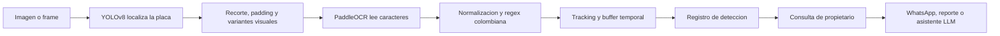
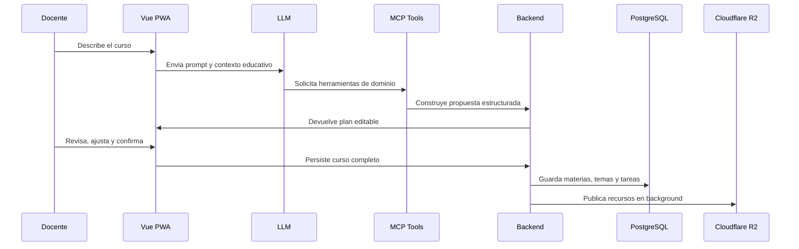
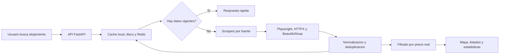

<div align="center">

<h1>Jesus David Herazo Rivera |   Engineer & IA Aplicada</h1>

<p>
  Portafolio tecnico enfocado en productos reales: arquitectura limpia, backend robusto,
  frontend profesional, automatizacion, vision por computadora, LLMs, RAG, scraping
  responsable, datos confiables y sistemas preparados para crecer en produccion.
</p>

<p>
  
  
  
  
  
  
</p>

<table>
  <tr>
    <td align="center"><strong>Producto</strong><br>Soluciones completas con impacto operativo y usuarios reales</td>
    <td align="center"><strong>Arquitectura</strong><br>Dominio desacoplado, casos de uso, puertos y adaptadores</td>
    <td align="center"><strong>IA y datos</strong><br>Modelos, scraping, cache y procesos conectados a negocio</td>
    <td align="center"><strong>Calidad</strong><br>Validacion, pruebas, resiliencia, trazabilidad y despliegue cloud</td>
  </tr>
</table>

</div>

## GitHub Stats

<div align="center">
  <p>
    
  </p>

  <table>
    <tr>
      <td>
        
      </td>
    </tr>
    <tr>
      <td>
        
      </td>
    </tr>
    <tr>
      <td>
        
      </td>
    </tr>
  </table>
</div>

## Perfil tecnico

Ingeniero full stack senior con enfoque en construir productos completos, no solo features aisladas. Los proyectos de este portafolio combinan backend, frontend, datos, seguridad, integraciones externas, scraping responsable e inteligencia artificial aplicada a flujos reales.

El criterio tecnico se refleja en decisiones como arquitectura hexagonal, separacion de dominio e infraestructura, contratos tipados, validacion temprana, procesos asincronos, webhooks seguros, observabilidad, despliegue cloud y uso responsable de modelos de IA dentro de productos con reglas de negocio.

## Proyectos destacados

<table>
  <tr>
    <td width="33%" valign="top">
      <h3>01. Placa ALPR</h3>
      <p><strong>Sistema de reconocimiento automatico de placas vehiculares con vision por computadora, OCR, tiempo real y asistente LLM.</strong></p>
      <p>
        Backend profesional para detectar placas en imagenes y video, validar formatos colombianos,
        registrar eventos, consultar propietarios, notificar por WhatsApp y responder preguntas
        administrativas con IA conversacional.
      </p>
      <p>
        <strong>Especialidad:</strong> Computer Vision, OCR, FastAPI, WebSockets, PostgreSQL,
        Celery, Redis, WhatsApp, reportes, seguridad e integracion LLM.
      </p>
    </td>
    <td width="33%" valign="top">
      <h3>02. CourseV</h3>
      <p><strong>Plataforma educativa full stack con IA generativa, RAG, MCP, contenido visual y automatizacion academica.</strong></p>
      <p>
        Producto educativo para crear y administrar cursos, materias, temas, tareas, entregas,
        progreso, certificados y experiencias de aprendizaje enriquecidas con IA.
      </p>
      <p>
        <strong>Especialidad:</strong> Vue 3, TypeScript, HTML, CSS, Node.js, Express, Socket.io,
        Supabase, pgvector, Cloudflare R2, pagos, PWA, LLMs y automatizacion de contenido.
      </p>
    </td>
    <td width="33%" valign="top">
      <h3>03. Habitat Lens</h3>
      <p><strong>Plataforma de busqueda de alojamientos con scraping responsable, normalizacion de datos, cache distribuida y mapa interactivo.</strong></p>
      <p>
        Sistema orientado a datos reales desde fuentes publicas como Airbnb, Booking,
        Finca Raiz, Metrocuadrado, Facebook Marketplace y Roomster.
      </p>
      <p>
        <strong>Especialidad:</strong> FastAPI, Playwright, HTTPX, BeautifulSoup, Redis,
        Nginx, Docker, Next.js, React, TypeScript y Leaflet.
      </p>
    </td>
  </tr>
</table>

## Proyecto 01: Placa ALPR

Placa ALPR es un sistema backend para reconocimiento automatico de matriculas vehiculares en escenarios institucionales. La solucion integra deteccion con YOLOv8, lectura OCR con PaddleOCR, validacion de placas colombianas, registro historico, consulta de propietarios, streaming en tiempo real y notificaciones por canales externos.

El valor del proyecto esta en convertir modelos de IA en una operacion real: cada deteccion pasa por reglas de dominio, persistencia, validacion, trazabilidad y acciones posteriores como busqueda de propietario, alerta pedagogica, reporte administrativo o respuesta conversacional por WhatsApp.

### Arquitectura y decisiones senior

| Decision tecnica | Valor profesional |
| --- | --- |
| Dominio independiente | Entidades, value objects y puertos sin dependencia directa de FastAPI, SQLAlchemy, Celery, YOLO o PaddleOCR. |
| Arquitectura por capas | Separacion entre dominio, aplicacion, infraestructura, web, datos, IA, auth, notificaciones y tareas asincronas. |
| Puertos y adaptadores | Los casos de uso dependen de interfaces; los proveedores externos se encapsulan como implementaciones reemplazables. |
| Value Object `PlateNumber` | Normaliza y valida formatos colombianos `AAA000` y `AAA00A` desde el centro del dominio. |
| DTOs con Pydantic | Contratos claros para entrada y salida de API, reduciendo errores entre frontend, backend e integraciones. |
| Composition root | Inyeccion de dependencias desde `dependencies.py`, manteniendo bajo acoplamiento entre casos de uso e infraestructura. |
| Readiness de modelos | Endpoint de estado para exponer si YOLO y PaddleOCR ya estan listos antes de aceptar detecciones pesadas. |
| Resiliencia operativa | Si falla base de datos, broker o notificacion, el pipeline puede devolver la deteccion sin bloquear el resultado principal. |
| Webhooks seguros | Validacion HMAC-SHA256, deduplicacion e idempotencia para mensajes entrantes de WhatsApp. |
| Pruebas focalizadas | Cobertura en autenticacion, rutas publicas, flujo OCR, registros y fallos runtime. |

### IA aplicada en Placa ALPR



| Componente de IA | Aplicacion en producto |
| --- | --- |
| YOLOv8 | Localizacion de placas en imagenes y frames de camara. |
| PaddleOCR | Lectura de caracteres sobre recortes de placa con evaluacion de confianza. |
| OpenCV | Preprocesamiento con CLAHE, upscaling, sharpening, padding, rectificacion y manejo de blur. |
| Tiling 2x2 y 3x3 | Mayor recall en placas pequenas, lejanas o parcialmente visibles. |
| Validacion semantica | Rechazo de falsos positivos usando reglas de formato colombiano. |
| Tracking temporal | Estabilidad entre frames para mejorar precision y reducir lecturas duplicadas. |
| Vote buffer | Confirmacion por consistencia antes de tratar una placa como deteccion confiable. |
| LLM por WhatsApp | Asistente administrativo que consulta contexto de base de datos y responde segun permisos. |

### Capacidades funcionales

| Modulo | Capacidades |
| --- | --- |
| ALPR | Deteccion REST, deteccion en vivo por WebSocket, multiples placas, confianza, bbox y resultado normalizado. |
| Usuarios y vehiculos | Registro de personas, vehiculos, propietarios, busqueda por placa y listado unificado de placas. |
| Persistencia | PostgreSQL, SQLAlchemy, repositorios por dominio, historico de detecciones y conteo de placas unicas. |
| Notificaciones | WhatsApp con YCloud/Twilio, email con SendGrid/Resend y tareas asincronas con Celery/Redis. |
| Asistente LLM | Preguntas administrativas, resumen de detecciones, usuarios notificados y reportes desde datos reales. |
| Seguridad | JWT, Google OAuth, roles, superusuario bootstrap, validacion de payloads y proteccion de webhooks. |
| Operacion | Docker, Railway, health checks, readiness checks, logs con Loguru y degradacion controlada. |

### Stack tecnico

<table>
  <tr>
    <td><strong>Backend</strong></td>
    <td>Python, FastAPI, Uvicorn, Pydantic, Loguru</td>
  </tr>
  <tr>
    <td><strong>IA / Vision</strong></td>
    <td>YOLOv8, Ultralytics, OpenCV, PaddleOCR, Pillow, NumPy, Hugging Face Hub</td>
  </tr>
  <tr>
    <td><strong>Datos</strong></td>
    <td>PostgreSQL, SQLAlchemy, Alembic, repositorios por dominio</td>
  </tr>
  <tr>
    <td><strong>Tiempo real</strong></td>
    <td>WebSockets, sesiones de streaming, broadcast de frames y tracking temporal</td>
  </tr>
  <tr>
    <td><strong>Async</strong></td>
    <td>Celery, Redis, tareas retry-safe y despacho no bloqueante</td>
  </tr>
  <tr>
    <td><strong>Integraciones</strong></td>
    <td>WhatsApp Business/YCloud, Twilio, SendGrid, Resend, OpenRouter, Cloudflare R2</td>
  </tr>
  <tr>
    <td><strong>Calidad</strong></td>
    <td>Unittest, FastAPI TestClient, mocks, SQLite in-memory y pruebas de resiliencia runtime</td>
  </tr>
</table>

### Estructura tecnica del backend

```text
backend/app/
  domain/
    entities.py          # Entidades, value objects y reglas centrales
    ports.py             # Interfaces para IA, repositorios y notificaciones
  application/
    use_cases.py         # Casos de uso y orquestacion de negocio
    dto.py               # Contratos Pydantic
  infrastructure/
    ai/                  # YOLO, PaddleOCR, pipeline, tracking, vote buffer, LLM
    auth/                # JWT, password hashing y Google OAuth
    db/                  # SQLAlchemy models, session y repositories
    notifications/       # WhatsApp, email y proveedores externos
    tasks/               # Celery y tareas asincronas
    web/                 # FastAPI routes, dependencies y WebSockets
```

## Proyecto 02: CourseV

CourseV es una plataforma educativa full stack creada para administrar aprendizaje digital con una experiencia moderna, automatizacion inteligente y herramientas de IA al servicio de docentes, estudiantes e instituciones.

El proyecto combina una PWA en Vue 3 con un backend modular en Node.js/Express. Su enfoque no es solo mostrar cursos, sino automatizar la creacion de contenido, enriquecer materiales, asistir conversaciones, generar recursos visuales y operar procesos academicos con contexto real.

### Producto y experiencia

| Area | Resultado |
| --- | --- |
| Cursos | Creacion, administracion y consumo de cursos estructurados por materias, temas y actividades. |
| Docentes | Herramientas para generar contenido, organizar material, revisar entregas y acelerar trabajo academico. |
| Estudiantes | Experiencia PWA, progreso, tareas, entregas, retroalimentacion y aprendizaje asistido. |
| Instituciones | Multi-tenant, roles, permisos, colaboradores y gestion centralizada. |
| Contenido visual | Miniaturas, guias, comics, videos o slideshows generados para reforzar conceptos. |
| Comunicacion | Chat, notificaciones, WhatsApp, email, sockets y eventos en tiempo real. |

### IA aplicada en CourseV

| Capacidad de IA | Aplicacion |
| --- | --- |
| Generacion de cursos por prompt | El docente describe una idea y el sistema propone estructura, materias, temas, tareas y objetivos. |
| Human-in-the-loop | Las propuestas generadas por IA se revisan y confirman antes de persistir cambios importantes. |
| RAG academico | Respuestas con contexto de documentos, tareas, materiales y datos educativos reales. |
| MCP | Herramientas controladas para que el modelo consulte dominio y ejecute acciones autorizadas. |
| Generacion de recursos | Guias Word/PDF, miniaturas educativas, comics, imagenes y material visual. |
| Multimodalidad | Analisis de imagenes dentro del flujo educativo para explicar, corregir o complementar contenido. |
| Personalizacion | Refuerzo de aprendizaje con historial, progreso y contexto del estudiante. |
| Automatizacion docente | Reduccion de tareas repetitivas sin perder control humano sobre decisiones academicas. |

### Arquitectura y buenas practicas

| Practica | Aplicacion en CourseV |
| --- | --- |
| Arquitectura hexagonal | Separacion entre dominio, aplicacion, infraestructura y adaptadores externos. |
| Frontend por features | Organizacion por modulos de producto para mantener escalabilidad en una PWA compleja. |
| Estado centralizado | Pinia para datos compartidos, sesiones, flujos de usuario y experiencia reactiva. |
| Rutas protegidas | Vue Router, JWT, roles y permisos por contexto. |
| Servicios modulares | Backend con responsabilidades separadas para IA, pagos, storage, sockets, auth y dominio academico. |
| Validacion de contratos | Joi, DTOs y validaciones para proteger bordes de entrada. |
| Procesos asincronos | Generacion pesada de documentos, recursos visuales y videos fuera del request principal. |
| Integraciones robustas | Supabase/PostgreSQL, pgvector, Cloudflare R2, Wompi, FCM, WhatsApp y email. |
| Resiliencia | Circuit breaker, idempotencia, retries y manejo explicito de fallos externos. |

### Flujo de creacion de curso con IA



### Stack tecnico

<table>
  <tr>
    <td><strong>Frontend</strong></td>
    <td>Vue 3, TypeScript, Vite, Pinia, Vue Router, HTML5, CSS3, PWA</td>
  </tr>
  <tr>
    <td><strong>Backend</strong></td>
    <td>Node.js, Express, Socket.io, Joi, JWT, servicios modulares</td>
  </tr>
  <tr>
    <td><strong>IA</strong></td>
    <td>LLMs, RAG, MCP, generacion de contenido, vision, embeddings y automatizacion academica</td>
  </tr>
  <tr>
    <td><strong>Datos</strong></td>
    <td>Supabase, PostgreSQL, pgvector, almacenamiento de progreso y contenido</td>
  </tr>
  <tr>
    <td><strong>Cloud</strong></td>
    <td>Cloudflare R2, Railway, Wrangler, Docker y despliegues orientados a producto</td>
  </tr>
  <tr>
    <td><strong>Integraciones</strong></td>
    <td>Wompi, WhatsApp, FCM, email, sockets y servicios externos</td>
  </tr>
</table>

## Proyecto 03: Habitat Lens

Habitat Lens es una plataforma de busqueda de alojamientos y propiedades que integra multiples fuentes publicas, normaliza resultados reales con precio, deduplica listados, expone una API de busqueda y presenta la informacion en una interfaz web con mapa, filtros y busqueda progresiva.

El objetivo tecnico del proyecto fue resolver un problema completo de datos: obtener informacion heterogenea desde fuentes externas, procesarla con consistencia, responder rapido al usuario y permitir que el backend escale horizontalmente sin duplicar trabajo costoso de scraping.

### Arquitectura aplicada

| Capa | Implementacion |
| --- | --- |
| Dominio y contratos | Modelos Pydantic para solicitudes, respuestas, fuentes, reportes, listados, coordenadas y estadisticas. |
| Casos de uso | Busqueda, normalizacion, filtrado, paginacion, deduplicacion, calculo de precios y estadisticas. |
| Entrada | API REST con FastAPI, endpoints de salud, busqueda, fuentes, cache y reportes. |
| Salida | Scrapers por fuente, Playwright para sitios dinamicos, HTTPX para paginas publicas y adaptadores de cache. |
| Infraestructura | Variables centralizadas, Docker, Nginx, Redis, cache local, cache en disco y replicas horizontales. |

La arquitectura separa el contrato principal de busqueda de los detalles de cada fuente externa. Esto permite cambiar una estrategia de scraping, una politica de cache o una pieza de infraestructura sin reescribir el producto completo.

### Flujo de datos



### Rendimiento y confiabilidad

| Practica | Aplicacion |
| --- | --- |
| Busqueda asincrona | Uso de `async/await` para coordinar scraping, cache y respuestas sin bloquear el servidor. |
| Extraccion progresiva | El usuario recibe resultados utiles mientras el sistema sigue enriqueciendo informacion en background. |
| Cache-first search | Consultas repetidas responden rapido usando memoria local, disco y Redis. |
| Cache distribuida | Redis comparte resultados entre replicas para reducir scraping duplicado. |
| Locks distribuidos | Evitan que varias replicas procesen la misma consulta costosa al mismo tiempo. |
| TTL y stale cache | Permiten respuestas inmediatas con datos vigentes o recientemente expirados. |
| Control de concurrencia | Semaforos y limites por fuente para mantener estabilidad frente a sitios externos. |
| Paginacion y mapa | Payloads separados para listados y coordenadas normalizadas en Leaflet. |
| Health checks | Monitoreo de runtime y componentes criticos. |
| Pruebas | `pytest` y `pytest-asyncio` sobre flujos de busqueda, cache y normalizacion. |

### Scraping responsable

| Principio | Aplicacion |
| --- | --- |
| Trazabilidad | Los datos visibles deben provenir de una fuente real y conservar contexto de origen. |
| Respeto por limites | Rate limiting configurable y control de concurrencia por fuente. |
| Identidad clara | User-Agent identificable para solicitudes automatizadas. |
| Sin automatizar acceso privado | No automatiza login, no evade captchas y no fuerza datos protegidos. |
| Auditoria por fuente | Reportes para revisar disponibilidad, limites, cantidad y calidad de resultados. |
| Fallback controlado | Modo demo separado de datos reales para evitar mezclar informacion fabricada con listados reales. |

### Stack tecnico

<table>
  <tr>
    <td><strong>Backend</strong></td>
    <td>Python, FastAPI, Uvicorn, Pydantic</td>
  </tr>
  <tr>
    <td><strong>Scraping</strong></td>
    <td>Playwright, HTTPX, BeautifulSoup, lxml, fuentes publicas y sitios dinamicos</td>
  </tr>
  <tr>
    <td><strong>Concurrencia</strong></td>
    <td>asyncio, async/await, semaforos por flujo y refresh en background</td>
  </tr>
  <tr>
    <td><strong>Cache</strong></td>
    <td>Memoria local, cache en disco, Redis, TTL, stale cache y locks distribuidos</td>
  </tr>
  <tr>
    <td><strong>Escalado</strong></td>
    <td>Docker, Nginx, replicas horizontales y estado compartido entre nodos</td>
  </tr>
  <tr>
    <td><strong>Frontend</strong></td>
    <td>Next.js, React, TypeScript, Leaflet, mapa interactivo, filtros y busqueda progresiva</td>
  </tr>
  <tr>
    <td><strong>Calidad</strong></td>
    <td>Pytest, pytest-asyncio, validacion de contratos y pruebas de comportamiento</td>
  </tr>
</table>

### Habilidades demostradas en Habitat Lens

| Habilidad | Evidencia |
| --- | --- |
| Diseno de APIs orientadas a datos | Contratos claros para busqueda, listados, fuentes, estadisticas y mapa. |
| Integracion de fuentes heterogeneas | Normalizacion de datos desde Airbnb, Booking, Finca Raiz, Metrocuadrado, Facebook Marketplace y Roomster. |
| Scraping de sitios dinamicos | Playwright para paginas renderizadas por navegador y HTTPX/BeautifulSoup para paginas publicas. |
| Deduplicacion y calidad de datos | Filtros para mostrar listados reales con precio y reducir resultados repetidos. |
| Rendimiento percibido | Respuestas rapidas con cache, stale data controlada y enriquecimiento progresivo. |
| Escalado horizontal | Redis, locks distribuidos, cache compartida, Nginx y replicas de backend. |
| Coordinacion backend/frontend | Conteos, mapa, filtros y listados alineados con el mismo estado de busqueda. |
| Operacion reproducible | Contenedores, configuracion centralizada y componentes auxiliares desacoplados. |

## Habilidades aplicadas en los proyectos

| Habilidad senior | Placa ALPR | CourseV | Habitat Lens |
| --- | --- | --- | --- |
| Arquitectura de software | Dominio desacoplado, puertos, adaptadores, casos de uso y repositorios. | Hexagonal, frontend por features, servicios modulares y fronteras de integracion. | Hexagonal, casos de uso de busqueda, adaptadores de fuentes y cache desacoplada. |
| IA y automatizacion | YOLOv8, PaddleOCR, OpenCV, tracking, vote buffer y LLM por WhatsApp. | LLMs, RAG, MCP, generacion de cursos, recursos visuales y automatizacion docente. | Automatizacion de extraccion, normalizacion, enrichment progresivo y reportes por fuente. |
| Backend robusto | FastAPI, WebSockets, Celery, Redis, PostgreSQL, JWT y webhooks seguros. | Node.js, Express, Socket.io, Supabase, pgvector, JWT y validacion de contratos. | FastAPI, Uvicorn, Pydantic, async/await, Redis, Nginx y replicas horizontales. |
| Frontend profesional | Integracion preparada para monitoreo, visualizacion y operacion en tiempo real. | Vue 3, TypeScript, HTML, CSS, PWA, rutas protegidas y experiencia por roles. | Next.js, React, TypeScript, Leaflet, filtros, mapa y busqueda progresiva. |
| Integraciones reales | WhatsApp, Twilio, YCloud, SendGrid, Resend, OpenRouter y Cloudflare R2. | Wompi, WhatsApp, FCM, email, Cloudflare R2, Supabase y proveedores de IA. | Airbnb, Booking, Finca Raiz, Metrocuadrado, Facebook Marketplace, Roomster y fuentes publicas. |
| Resiliencia | Readiness de modelos, fallback de DB, idempotencia, deduplicacion y logs. | Circuit breaker, jobs en background, retries e idempotencia en flujos sensibles. | Cache distribuida, locks, TTL, stale cache, control de concurrencia y health checks. |
| Calidad tecnica | Pruebas unitarias, mocks, DTOs, manejo de errores y validaciones de dominio. | Validacion, modularidad, control de permisos y separacion clara de responsabilidades. | Pytest, pytest-asyncio, contratos tipados, reportes por fuente y validacion de resultados. |
| Criterio de producto | Notificaciones pedagogicas, propietario por placa, reportes y asistente autorizado. | Creacion de cursos, contenido academico, progreso, certificados y apoyo docente. | Resultados reales con precio, deduplicacion, mapa, filtros y experiencia orientada a busqueda. |

## Tecnologias destacadas

<p>
  
  
  
  
  
  
  
  
  
  
  
  
  
  
  
  
  
  
  
</p>

## Enfoque profesional

Estos proyectos muestran una forma senior de construir software: primero se define el dominio, despues se disenan los flujos de negocio, luego se integran modelos, datos, automatizaciones e infraestructura, y finalmente se asegura que el sistema sea usable, medible, seguro y mantenible.

La inteligencia artificial no aparece como una demo aislada. En Placa ALPR se conecta con camaras, OCR, propietarios, permisos, notificaciones y reportes. En CourseV se conecta con cursos, docentes, estudiantes, materiales, progreso, RAG, MCP y generacion de contenido educativo. En Habitat Lens, el foco esta en datos reales, scraping responsable, cache distribuida, deduplicacion y una experiencia de busqueda consistente. Esa combinacion muestra criterio para construir productos profesionales con IA, automatizacion y sistemas web orientados a datos.
